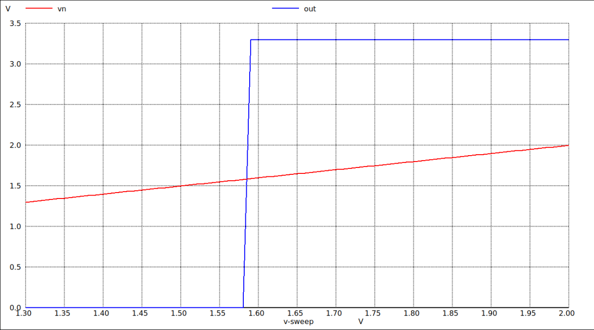
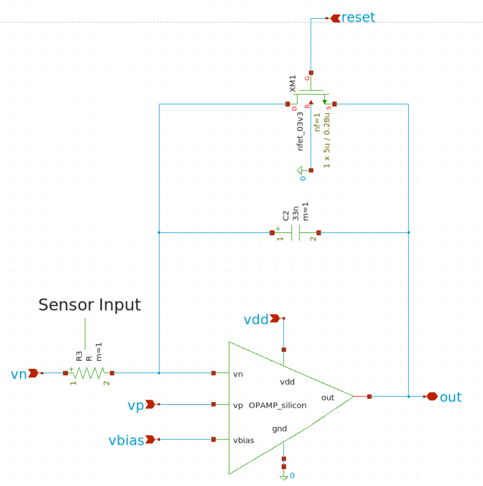
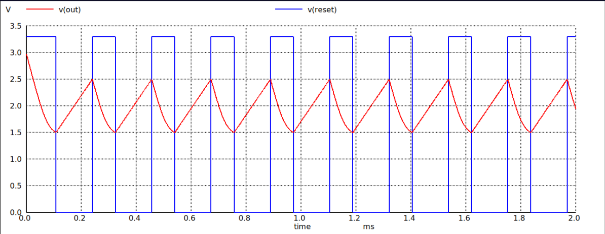
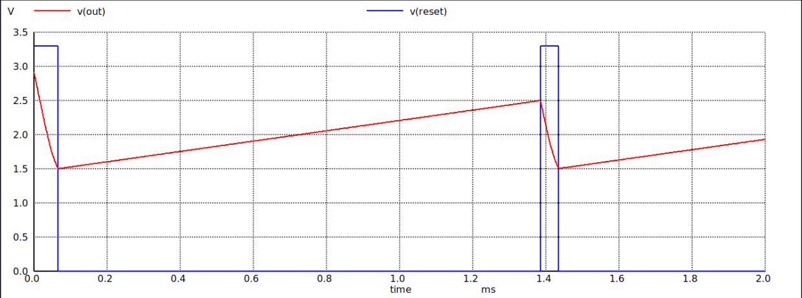

# Gas Sensor AFE ASIC — Team NanoArchitects

**IEEE SSCS Chipathon 2026, Track B** · GF180MCU 180nm CMOS PDK

A dual-modal analog front-end (AFE) ASIC for simultaneous MOX (metal-oxide) and EC (electrochemical) gas sensing.

| Feature | Description |
|---|---|
| **EC sensors** | Selective but slow — good for identifying gas type |
| **MOX sensors** | Fast response but lack selectivity — good for real-time detection |
| **Both in parallel** | Enables real-time cross-validation |
| **Target applications** | Industrial toxic-gas detection (CO, H₂S), VOC monitoring, process control |

## Block Diagram


## Status: All Blocks Complete ✅

| Block | Status |
|---|---|
| EC TIA | ✅ Complete |
| MOX Integrator + Reset Switch | ✅ Complete |
| Output Buffers | ✅ Complete |
| Bias Generator (BGR) | ✅ Complete |
| Comparators | ✅ Complete |

## Key Specifications

### Op-Amp (`opamp_poly`)

📄 [Full Datasheet (PDF)](docs/datasheets/OPAMP_Datasheet.pdf)

| Parameter | Value |
|---|---|
| Open-Loop Gain | 80.3 dB |
| Unity-Gain Bandwidth | 154.6 MHz |
| Phase Margin | 70.2° |
| CMRR | 102.8 dB |
| PSRR | 81.9 dB |
| Slew Rate (+/−) | 194.4 / 96.0 V/µs |
| Input Common-Mode Range | 38 mV – 3.06 V |
| Output Swing | 0 V – 3.23 V @ VDD = 3.3 V |
| Quiescent Current | 943 µA |

### EC Channel — Transimpedance Amplifier (TIA)

| Parameter | Value |
|---|---|
| Open-Loop Gain | 74 dB |
| Phase Margin | 65° (unconditionally stable) |
| Bandwidth | 5 MHz |
| Rf ∥ Cf | 7 kΩ ∥ 9 pF |
| Input Range | 100 nA (2.7995 V) – 373 µA (0.935 V) |
| Full Swing | ≈ 1.865 V, single output, no range switching |

### MOX Channel — Integrator (Methane Sensor)

| Parameter | Value |
|---|---|
| Clean-Air Resistance (R0) | 20–70 kΩ |
| Gas-Present Resistance (RS) | 2–20 kΩ @ 5000 ppm methane |
| Integrator Current Range | 14 µA – 500 µA |
| System Parameters | Vp = 1.3 V, ΔV = 0.5 V, Cint = 10 µF |
| Reset Pin | `RESET_INT`, active-high, MCU-controlled |

### Bias Generator (BGR)

| Parameter | Value |
|---|---|
| Reference Voltage | 1.2 V bandgap core, scaled to Vp = 2.8 V |
| Supply Voltage | 3.3 V |
| Temperature Coefficient | < 50 ppm/°C |
| Power Consumption | < 50 µA |

**Multi-rail bias distribution.** The BGR core outputs a single reference (`Vref`), which is buffered through `OPAMP_silicon` (unity-gain, the same op-amp topology used elsewhere on-chip) and then divided through a resistor ladder (R1–R4) to generate every bias voltage required by the other blocks: `v_2.8` (EC TIA virtual ground), `voref`, and `v_1.3` / `v_0.8` (MOX integrator system voltages). Using a single buffered reference plus a resistor ladder — instead of separate bandgap cores per block — keeps all bias points ratiometrically matched and saves die area.

## Pin Assignment (~15 pads)


## Estimated Die Area

**Total: 0.5 – 0.6 mm²**

---

## Simulation Results

### Op-Amp

🔗 [View Op-Amp schematic file (`opamp_poly.sch`)](xschem/opamp/opamp_poly.sch)

| Schematic | AC Bode (Gain 80 dB) | Phase Margin (70°) |
|---|---|---|
|  |  |  |

| CMRR (102 dB) | PSRR (81.9 dB) | ICMR (0.2 – 3.1 V) |
|---|---|---|
|  |  |  |

**Slew Rate:** rising SR = 194.4 V/µs, falling SR = 96.0 V/µs — asymmetry expected due to sourcing/sinking drive imbalance in the output stage (confirmed against datasheet).


**Op-Amp Summary:** The AC response confirms a high open-loop gain (>80 dB) and excellent stability with a 70.2° phase margin. High CMRR (>102 dB) and PSRR (>81 dB) ensure the amplifier remains highly robust against supply noise and common-mode fluctuations, which is essential for accurate, low-noise sensor signal conditioning.

### Output Buffers

🔗 [View Buffer schematic file (`buffer.sch`)](xschem/output_buffer/buffer.sch)

**Buffer Schematic:**


**Transient Waveform:**


**Buffer Summary:** The operational amplifier buffer provides essential signal isolation and drive capability. It is instantiated twice within the AFE architecture: (1) to provide sufficient drive strength to pass the EC TIA output voltage to an off-chip ADC, and (2) to supply a highly stable, low-impedance reference bias to the MOX integrator. Transient simulations verify that the buffer faithfully tracks dynamic signals with excellent settling time and minimal distortion under load.

### Comparators

🔗 [View Comparator schematic file (`comp.sch`)](xschem/comparator/comp.sch)

**Comparator Schematic:**


**Transient Waveform:**


**Comparator Summary:** The comparator acts as the critical bridge between the analog sensor front-end and the digital logic domain, providing precise threshold detection to trigger system alerts or wake-up events when gas concentrations exceed predefined safety levels. The transient simulation validates its fast response and confirms its inverting topology: the output drives low (0) when the sensor signal exceeds the reference voltage (Vin > Vref), and transitions high (1) when it drops below the threshold. This active-low configuration ensures reliable event triggering for downstream digital processing.

---

### EC TIA

🔗 [View TIA schematic file (`TIA.sch`)](xschem/ec_tia/TIA.sch)

🔗 [View top-level sensor system schematic (`ECSensorSim.sch`)](xschem/ec_tia/ECSensorSim.sch)


**AC response and DC linearity:**

| AC Bode | DC Sweep (Vout vs Iin) |
|---|---|
|  |  |

**Input/output noise spectrum:**

| Input-Referred Noise | Output Noise |
|---|---|
|  |  |

**Gas response (CO sensor):**

| Concentration (ppm) vs Current (µA) | Concentration (ppm) vs ADC Code |
|---|---|
|  |  |

**TIA Summary:** The transimpedance amplifier achieves excellent DC linearity across the entire 100 nA to 373 µA input range, directly translating into accurate ppm gas readings. The AC Bode plot confirms unconditional stability (65° phase margin), while the noise spectrum analysis demonstrates minimal input-referred noise — a critical requirement for resolving minute electrochemical sensor currents.

### MOX Integrator

🔗 [View MOX Integrator schematic file (`int.sch`)](xschem/mox_integrator/int.sch)

**Integrator Schematic:**


**Transient Waveform:**



> **Note:** To prevent the reset mechanism from stalling, the lower comparator threshold is set to 1.5 V, keeping it safely above the 1.3 V reference.

**MOX Integrator Summary:** The MOX sensor acts as a variable resistor whose resistance changes with environmental gas concentration. This varying resistance dictates the current entering the integrator's capacitor, which sets the time it takes for the output voltage to ramp from a 1.3 V reference baseline up to a 2.5 V threshold. An external MCU measures this ramp time to accurately determine the sensor resistance, which directly reflects the real-time gas concentration, as shown in the results above.

### Bias Generator (BGR)

🔗 [View BGR schematic file (`BGR_BJT.sch`)](xschem/bias_generator/BGR_BJT.sch)

**BGR Core Schematic:**


**Multi-Bias Distribution Schematic:**


**Simulation Results:**


**BGR Summary:** The U-curve validates a highly stable reference voltage with a temperature coefficient of less than 50 ppm/°C across the target thermal operating range. The multi-bias generation network successfully buffers and scales this core voltage to provide clean, ratiometrically matched sub-rails (2.8 V, 1.3 V, and 0.8 V) for all other on-chip blocks.

---

### Overall Circuit

🔗 [View overall circuit schematic file (`ECMOX_tran.sch`)](xschem/afe_top/ECMOX_tran.sch)

**Circuit Simulation Demo Video:** [Insert Link]

**System Simulation Results**

#### EC TIA System Linearity

Full-system simulations under load (worst-case load value of 100 pF) indicate a maximum linear TIA current limit of 340 µA. This comfortably exceeds the requirements of the target application, as the most demanding sensor (carbon monoxide) reaches a maximum output of only 102 µA at 1000 ppm. The table below characterizes the TIA's linearity up to this physical saturation limit (Mean Absolute Deviation: 1.97%).

| Vref (V) | I (µA) | Vout Calculated (V) | Vout Simulated (V) | Deviation (%) |
| :--- | :--- | :--- | :--- | :--- |
| 2.726 | 20 | 2.586 | 2.583 | −0.12% |
| 2.726 | 60 | 2.306 | 2.297 | −0.39% |
| 2.726 | 100 | 2.026 | 2.011 | −0.74% |
| 2.726 | 140 | 1.746 | 1.732 | −0.80% |
| 2.726 | 180 | 1.466 | 1.447 | −1.30% |
| 2.726 | 220 | 1.186 | 1.161 | −2.11% |
| 2.726 | 260 | 0.906 | 0.8747 | −3.45% |
| 2.726 | 300 | 0.626 | 0.5895 | −5.83% |
| 2.726 | 340 | 0.346 | 0.3522 | +1.79% |

#### MOX Integrator System Characterization

The table below validates system-level integrator performance across heavy gas leaks (2 kΩ) to clean-air baselines (60 kΩ), demonstrating a Mean Absolute Deviation of just 2.79% from theoretical calculations.

| VR (V) | C (nF) | Rs (kΩ) | Calculated Time (ms) | Simulated Time (ms) | Deviation (%) |
| :--- | :--- | :--- | :--- | :--- | :--- |
| 0.5 | 33 | 2 | 0.132 | 0.1288 | −2.42% |
| 0.5 | 33 | 20 | 1.320 | 1.3386 | +1.41% |
| 0.5 | 33 | 60 | 3.960 | 3.7799 | −4.55% |

---

## Repository Structure

```
├── docs/
│   ├── datasheets/       Component datasheets (PDF)
│   └── images/           Diagrams and simulation plots used in this README
├── xschem/               Schematic source files (.sch, .sym), one folder per block
│   ├── bias_generator/
│   ├── comparator/
│   ├── ec_tia/
│   ├── mox_integrator/
│   ├── opamp/
│   ├── output_buffer/
│   └── afe_top/          Overall AFE system integration schematic (ECMOX_tran.sch)
├── simulations/          Testbenches and .raw sim data
└── layout/               (in progress) GDS/layout files, DRC/LVS reports
```

## Team NanoArchitects

- Alaqmar
- Ankith B.
- Rishi Raghav S.
- Shaik Kareena
